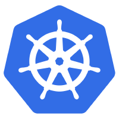

 

# Kubernetes the Hard Way Raspberry Pi

This tutorial is inspired in the [Kelsey Hightower's Kubernetes The Hard Way](https://github.com/kelseyhightower/kubernetes-the-hard-way), but targeted to the Raspberry Pi. This guide is not for people looking for a fully automated command to bring up a Kubernetes cluster. If that's you then check out [Google Container Engine](https://cloud.google.com/container-engine), or the [Getting Started Guides](http://kubernetes.io/docs/getting-started-guides/).

This tutorial is optimized for learning, which means taking the long route to help people understand each task required to bootstrap a Kubernetes cluster. This tutorial can be completed on the following platforms:

* [Raspberry Pi 2 Model B](https://www.raspberrypi.org/products/raspberry-pi-2-model-b/)
* [Raspberry Pi 3 Model B](https://www.raspberrypi.org/products/raspberry-pi-3-model-b/)

> The results of this tutorial should not be viewed as production ready, and may receive limited support from the community, but don't let that prevent you from learning!

# DISCLAIMER
The steps in this tutorial are "AS IS" without any warranties and support.
I'm not responsible for any misconfiguration or damages of the Raspberry Pi equipment involved on this tutorial.

## Target Audience

The target audience for this tutorial is someone who wants to get some hands on skills with the Kubernetes cluster and wants to understand how everything fits together. `If you're planning to support a production Kubernetes cluster, I highly recommend following Kelsey's tutorial instead`. After completing this tutorial I encourage you to automate away the manual steps presented in this guide.

* This tutorial is for educational purposes only. There is much more configuration required for a production ready cluster.

## Cluster Details

* Kubernetes 1.4.3 (ARM)
* Docker 1.12.3 (ARM)
* etcd 3.1.0-rc.1 (Built from source for ARM)
* [CNI Based Networking](https://github.com/containernetworking/cni)
* Secure communication between all components (etcd, control plane, workers)
* Default Service Account and Secrets

### What's Missing

The resulting cluster will be missing the following items:

* [Cluster add-ons](https://github.com/kubernetes/kubernetes/tree/master/cluster/addons)
* [Logging](http://kubernetes.io/docs/user-guide/logging)
* [No Cloud Provider Integration](http://kubernetes.io/docs/getting-started-guides/)
* Setup Kubernetes API Server Frontend Load Balancer

## Hardware and OS version

This tutorial assumes you have access to one of the following:

* 5 Raspberry Pi 2/3 Model B
* 2016-09-23-raspbian-jessie-lite or newer

## Labs

* [Infrastructure Provisioning](docs/01-infrastructure.md)
* [Setting up a CA and TLS Cert Generation](docs/02-certificate-authority.md)
* [Bootstrapping an H/A etcd cluster](docs/03-etcd.md)
* [Bootstrapping an H/A Kubernetes Control Plane](docs/04-kubernetes-controller.md)
* [Bootstrapping Kubernetes Workers](docs/05-kubernetes-worker.md)
* [Configuring the Kubernetes Client - Remote Access](docs/06-kubectl.md)
* [Managing the Container Network Routes](docs/07-network.md)
* [Deploying the Cluster DNS Add-on](docs/08-dns-addon.md)
* [Smoke Test](docs/09-smoke-test.md)
* [Cleaning Up](docs/10-cleanup.md)
